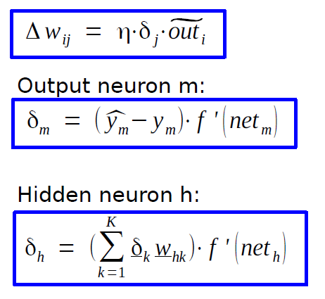
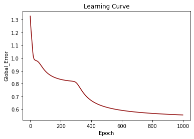
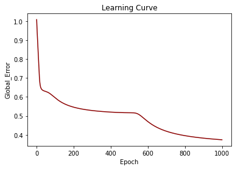
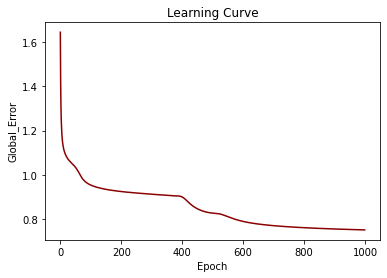
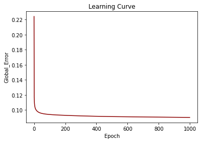

# Training a Multi-Layer Perceptron (MLP) Neural Network using Backpropagation

A **team project** [https://github.com/Mahnaz-Mirhaj](https://github.com/Mahnaz-Mirhaj) implementing a **Multi-Layer Perceptron (MLP)** neural network from scratch using **Backpropagation**. The network is trained to predict outputs for given inputs, with weight updates based on the difference between the target and predicted outputs (single-step learning).

---

## 📌 Overview
- **Feedforward Process:** Computes/predicts the output for a given input.
- **Backpropagation:** Updates weights using the difference between the target and predicted outputs.
- **Error Function:**
  \[
  \text{Error} = \frac{\sum (y - h(x))^2}{\text{number of inputs}}
  \]
  where \( y \) is the desired output and \( h(x) \) is the network's output.

- **Delta Rule for Weight Updates:**
  
  *(Source: Dr. Nils Goerke, Technical Neural Networks, University of Bonn, WS20/21)*

---

## 🔧 Customizable Architecture
Users can configure:
- **Number of hidden layers**
- **Number of neurons in each hidden layer**
- **Transfer functions** for each layer:
  - Logistic Function
  - Tanh
  - Identity

---

## 📈 Outputs
The program generates:
- **Learning curves** for each dataset.
- A `.txt` file containing the **global error** for every epoch.

### Learning Curves
| Dataset | Learning Curve |
|---------|----------------|
| 1       |  |
| 2       |  |
| 3       |  |
| 4       |  |

---

## 📚 Reference
[1] Dr. Nils Goerke: *Technical Neural Networks, 02: Perzeptron, Multi Layer Perzeptron and Backpropagation of Error*, 18.10.2033, MA-INF 4204, WS20/21, University of Bonn.
