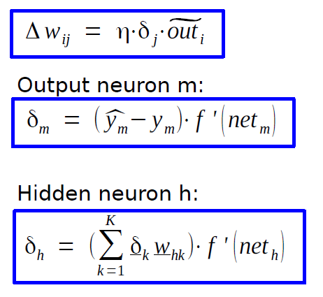
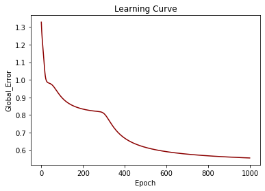
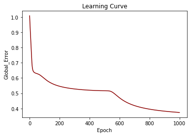
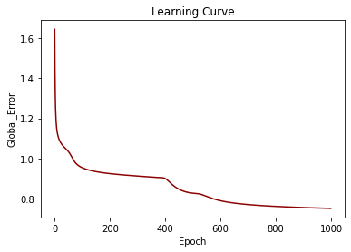
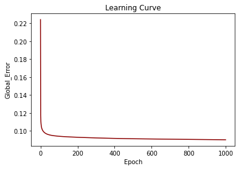

# Training-a-MLP_Neural-Network-using-Backpropagation
Team work project with https://github.com/maahnaaz

In this project, we created a neural network, and based on the data files, we trained the network using Backpropagation from the scratch. Given an input, the network computes/predicts the output in the Feedforward process. If we are training the model, then the difference of target output and predicted output are backpropagated to the network to update the weights. (Single-step learning)

You can see delta rule for updating weights here: [1]

Error function = sum(y - h(x))^2 / # inputs which y is desired output and h(x) is the output of the network.

A user can change the number of hidden layers, the number of neurons in each hidden layer, and the transfer functions (Logistic Function, Tanh, Identity) in each layer.
The output of the program is a learning curve and a .txt file that includes the global error of every epoch. 

Learning curve for dataset 1:

Learning curve for dataset 2:

Learning curve for dataset 3:

Learning curve for dataset 4:

[1]: Dr. Nils Goerke: Technical Neural Networks, 02: Perzeptron, Multi Layer Perzeptron and Backpropagation of Error, 18.10.2033, MA-INF 4204, WS20/21
